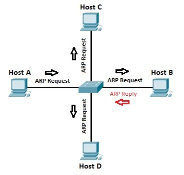

# ARP

ARP stands for **Address Resolution Protocol**.

It is a protocol which is used in **IPv4 networks** to find the **MAC (Media Access Control) address** associated with a **known IP address** on the **local network**.

For example, **Computer A (`192.168.1.10`)** wants to send data to:

* **Computer B**
* IP address is `192.168.1.114`
* But Computer A doesn't know Computer B's MAC address.

## REQUEST — BROADCAST

So, Computer A will send a request to **every device on the local network**:

> Who has `192.168.1.114`? Tell `192.168.1.10`.

This will be received by **every device in the same local network/broadcast domain**.

## REPLY — UNICAST

Computer B will also receive the broadcasted request. It will recognize that it owns the IP address `192.168.1.114` and directly send its MAC address to:

**Computer A (`192.168.1.10`)**

### REPLY

> I'm `192.168.1.114`. Here is my MAC: `AA:BB:CC:DD:EE:FF`

## MAC Resolution

Computer A stores the mapping in its **ARP cache**:

| IP Address      | MAC Address         |
| --------------- | ------------------- |
| `192.168.1.114` | `AA:BB:CC:DD:EE:FF` |

Computer A can now put the destination MAC address into **Ethernet frames** and send the traffic.

