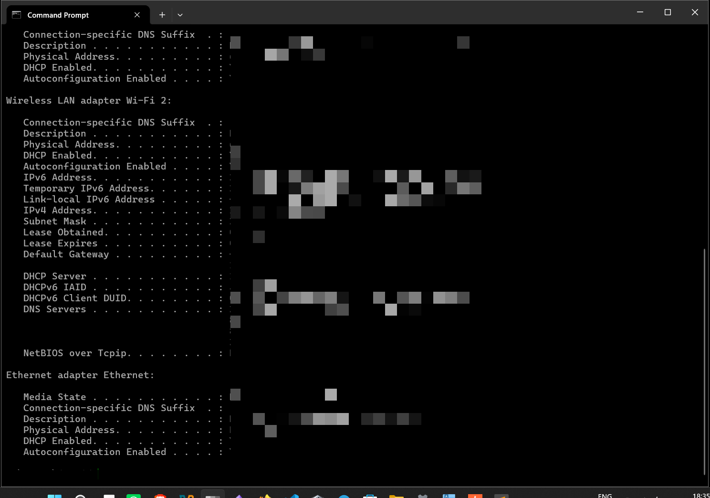
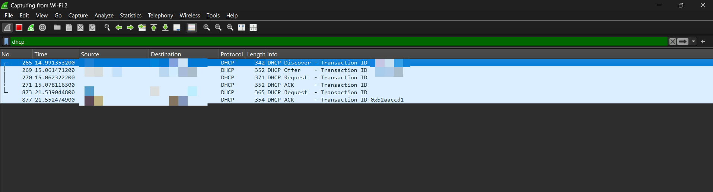
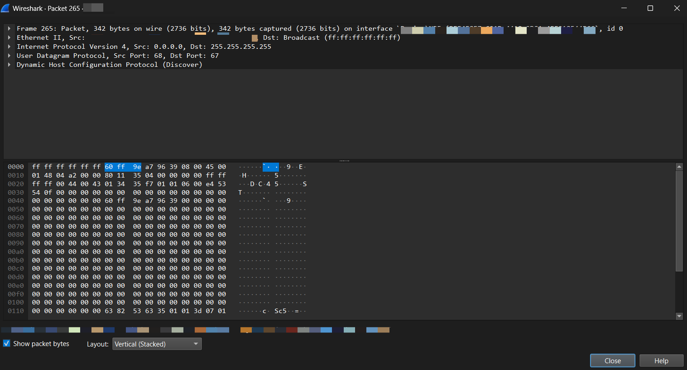
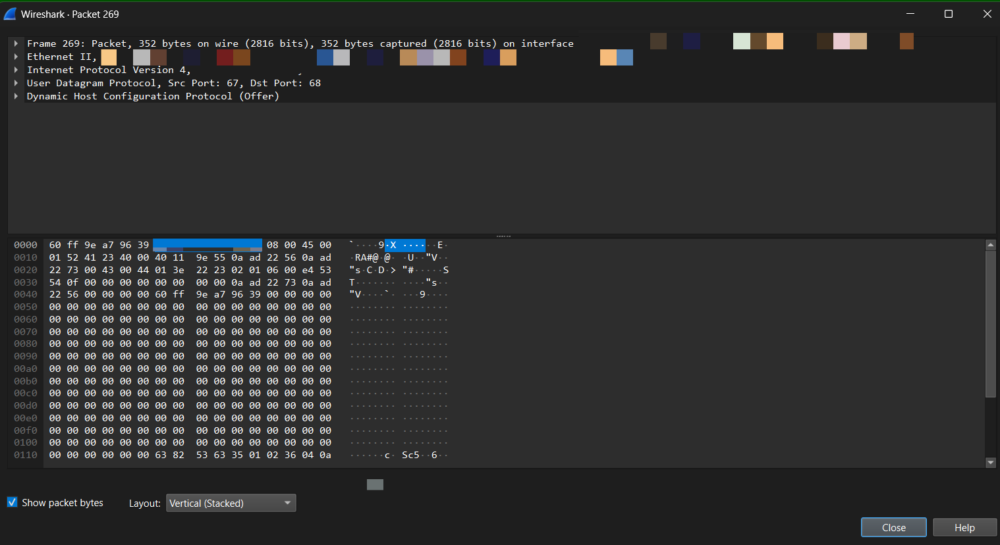
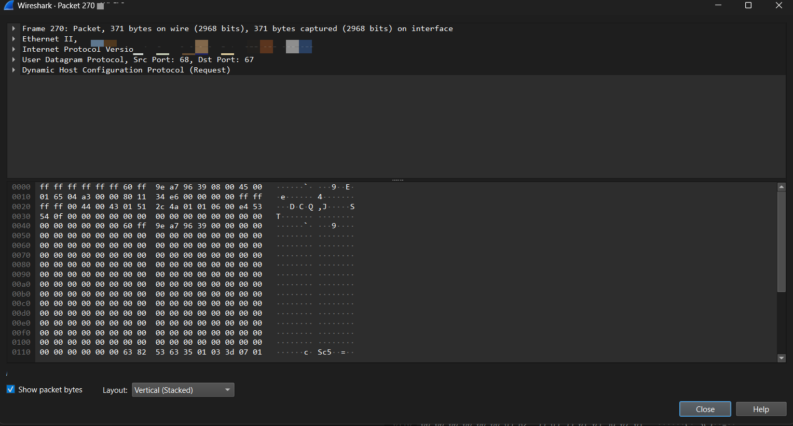
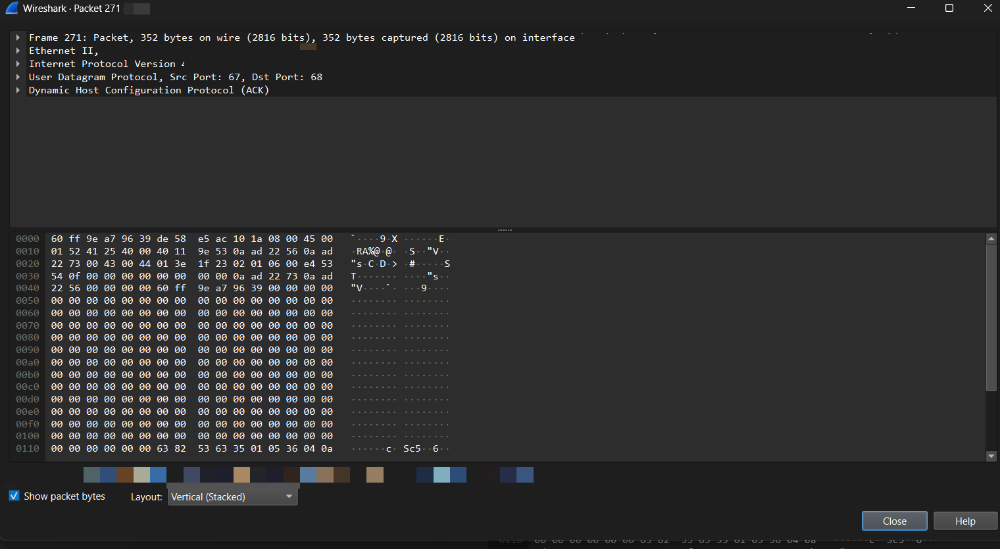

# DHCP - DORA PROCESS

> All the devices connected to a network are assigned a unique 32-bit IP address.

There are two methods of IP address assignment:

#### STATIC

* Static IP addresses are manually configured by an administrator or assigned as a permanent lease by an ISP.
* Static IP addresses generally do not change.
* Provides a stable and uninterrupted connection, ideal for remote access and hosting.

#### DYNAMIC

* IP addresses are assigned to each device in the network by a DHCP server.
* A dynamic IP address can change periodically and is assigned automatically by a DHCP server, such as a home router, or by an ISP.
* Dynamic IP assignment is the default option used by most networks.
* Better for privacy because changing your address periodically can make it harder for trackers to associate activity with the same IP address. However, changing IP addresses is not a strong security measure by itself.

### DHCP - Dynamic Host Configuration Protocol

DHCP is a network management protocol that automatically provides network configuration to a device, such as:

* IP address
* DNS server
* Subnet mask
* Default gateway
* Lease duration

DHCP uses **User Datagram Protocol (UDP)**.

##### DHCP Scope

The **DHCP scope** is the range of available IP addresses that the DHCP server is allowed to assign to clients, along with the configuration associated with that range.

The **DHCP pool** is commonly used to refer to the available range of addresses that can be assigned to clients.

Example:

```text
DHCP Server: 192.168.1.1

Pool:
192.168.1.100
192.168.1.101
192.168.1.102
...
192.168.1.200
```

##### DHCP Lease

A **DHCP lease** is the amount of time a DHCP-assigned IP address is temporarily allocated to a device.

Example:

```text
Client → 192.168.1.100
Lease → 8 hours
```

The client doesn't permanently own `192.168.1.100`.

It can use it for the duration of the lease.

Before the lease expires, the client normally tries to **renew** it.

### DORA PROCESS

**Discover:** The client doesn't have an IP address, so it broadcasts a DHCP Discover message to find a DHCP server.

**Offer:** The DHCP server receives the Discover and offers the client an IP address and other network configuration.

**Request:** The client selects an offer and requests that configuration from the DHCP server.

**ACK:** The DHCP server confirms the lease and the client can use the assigned network configuration.

### Practical

**Practical:** Used `ipconfig /all` to inspect the DHCP configuration and Wireshark to capture and analyze the DHCP DORA process.

Observed the **DHCP Discover, Offer, Request, and ACK** packets and examined their:

* IP addresses
* MAC addresses
* UDP ports
* Transaction ID

### Commands and Captures

#### `ipconfig /all`

`ipconfig /all` was used to inspect the network adapter's DHCP configuration.




#### Wireshark Capture - DORA Configuration




#### DHCP Discover Packet



#### DHCP Offer Packet




#### DHCP Request Packet




#### DHCP ACK Packet



### Conclusion
Understood the **DHCP DORA process** and the principles of dynamic IP address assignment. Performed a hands-on practical using `ipconfig /all` and **Wireshark** to capture and analyze the DHCP Discover, Offer, Request, and ACK packets.

